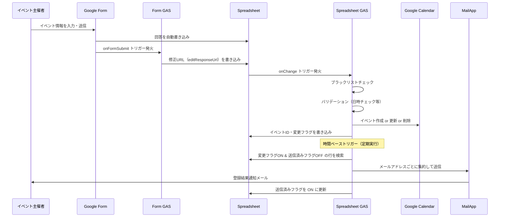
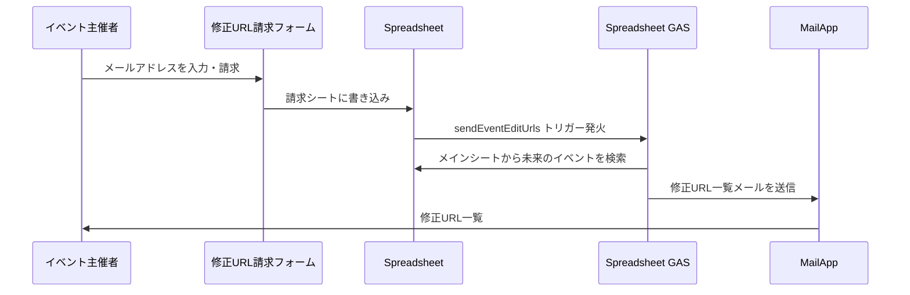

# アーキテクチャ設計書 (Architecture Design Document)

## 1. テクノロジースタック

### 言語・ランタイム

| 技術 | バージョン | 選定理由 |
|------|-----------|----------|
| JavaScript | ES2015+ (GAS対応範囲) | Google Apps Script のネイティブ言語。V8ランタイムにより `const`/`let`、アロー関数、テンプレートリテラル等が使用可能 |
| Google Apps Script | V8 ランタイム | Google Workspace サービス（Forms, Sheets, Calendar, Mail）とのネイティブ統合。サーバー管理不要 |

### 開発ツール

| 技術 | 用途 | 選定理由 |
|------|------|----------|
| clasp | GAS プロジェクトのローカル開発・デプロイ | GAS コードの Git 管理を可能にする公式 CLI ツール |
| Git | バージョン管理 | コード変更履歴の追跡、複数環境のコード管理 |

### 外部サービス

| サービス | 用途 | 選定理由 |
|----------|------|----------|
| Google Forms | イベント情報の入力 UI | フォーム作成・管理が容易。回答がスプレッドシートに自動連携 |
| Google Sheets | データストア（マスターデータ） | フォーム回答の自動保存先。手動での確認・修正も可能 |
| Google Calendar | イベント表示 | VRChat コミュニティへのイベント公開手段 |
| MailApp | メール通知 | GAS 組み込みのメール送信機能。追加設定不要 |

---

## 2. システム構成

### 環境構成

```
vrc-calendar-gas/
├── prod/          ← 本番環境（vrceve.com で公開中のカレンダー）
└── dev/           ← 開発環境（※現在未配置。再構築時に prod からコピーして作成する）
```

各環境は独立した GAS プロジェクト（scriptId）を持ち、それぞれ異なる Google Calendar・Spreadsheet に接続する。

> **注意**: dev 環境は過去に prod と大幅に乖離したため削除済み。次回の開発作業時に、prod のコードをベースに再構築する。Google 上の dev 用 GAS プロジェクト・リソース自体は存在する。

### 環境ごとの Google リソース対応表

#### prod（本番環境）

| リソース種別 | 名称 | ID |
|------------|------|----|
| Google Form | VRChatイベントカレンダー2024 | — |
| Form GAS プロジェクト | — | scriptId: `1ZxJXzMuSCFfPLzmbhXaThAUl8gxcy3BMG22x4VUhPvVdkzmBJMu81aXz` |
| Google Spreadsheet | VRChatイベントカレンダー | ID: `1khYEj0t3eI2LnYxgnN3uJUKHHQg8CJTk3JD3vITQlQc` |
| Spreadsheet GAS プロジェクト | — | scriptId: `1o4UZLVDBJvKQlQSJtugy0uBPW9GOVhZhZJxgbeMZ-XHcxc5A2LLmEO-W` |
| Google Calendar | — | `0058cd78d2936be61ca77f27b894c73bfae9f1f2aa778a762f0c872e834ee621@group.calendar.google.com` |

#### dev（開発環境）— リソース情報

> **現在の状態**: dev/ ディレクトリはローカルリポジトリから削除済み。以下の Google リソースはリモートに存在し、再構築時に使用する。

| リソース種別 | 名称 | ID |
|------------|------|----|
| Google Form | 【検証用】VRChatイベントカレンダー2024 | — |
| Form GAS プロジェクト | createCalendarEvent_form_test | scriptId: `12mqT0Ciyy-qSg_9_55lUnpP_A-MzVPFcvhAHkAAL0vWHrBrfYcDN3Fat` |
| Google Spreadsheet | 【検証用】VRChatイベントカレンダー2024（回答） | ID: `1rHTVTMSDbWq9XDY1dkAY7Sr99TNvlz35DuupZsgaRoE` |
| Spreadsheet GAS プロジェクト | — | scriptId: `1ZOOWCMWJn1RjMuIMfryNR3KoDXBEmJ04Kgn4CAizf2YBrAox9Gn5U45H` |
| Google Calendar | — | `6837aa0e09b99b8e9443aa0c4132920f0827d5aeb85b2a1c0768283ee04b8ab5@group.calendar.google.com` |

### GAS プロジェクト構成（環境あたり）

```
┌──────────────────────────────────────────────────┐
│  Google Form                                      │
│  ┌────────────────────────────────┐               │
│  │ Form GAS プロジェクト            │               │
│  │   onFormSubmit()               │               │
│  └──────────┬─────────────────────┘               │
│             │ editResponseUrl を書き込み            │
│             ↓                                     │
│  Google Spreadsheet                               │
│  ┌────────────────────────────────────────┐       │
│  │ Spreadsheet GAS プロジェクト              │       │
│  │   createOrUpdateCalendarEvent()       │       │
│  │   sendAggregatedEmails()              │       │
│  │   sendEventEditUrls()                 │       │
│  │   getColumnMapping()                  │       │
│  │   getBlacklists()                     │       │
│  └──────────┬───────────┬────────────────┘       │
│             │           │                         │
│             ↓           ↓                         │
│     Google Calendar   MailApp                     │
└──────────────────────────────────────────────────┘
```


---

## 3. 処理フロー

### 全体フロー



### 修正URL請求フロー



---

## 4. データ永続化

### ストレージ方式

| データ種別 | ストレージ | 用途 |
|-----------|----------|------|
| イベント情報 | Google Sheets「フォームの回答 1」シート | マスターデータ。フォーム回答が自動で蓄積される |
| 修正URL請求 | Google Sheets「修正URL請求」シート | 請求フォームの回答が自動蓄積 |
| ブラックリスト | Google Sheets「語録リスト」シート | 管理者が手動で管理 |
| カレンダーイベント | Google Calendar | 公開されるイベントデータ |

### スプレッドシート列構成（メインシート）

| 列名 | 型 | 説明 |
|------|-----|------|
| メールアドレス | String | 登録者のメールアドレス |
| 修正URL | String | フォーム回答の編集リンク |
| イベント名 | String | イベント名称 |
| 開始日時 | Date | イベント開始日時 |
| 終了日時 | Date | イベント終了日時 |
| イベント主催者 | String | 主催者名 |
| Android対応可否 | String | PC/android, android only, または空 |
| イベント内容 | String | イベントの詳細説明 |
| イベントジャンル | String | ジャンル分類 |
| 参加条件（モデル、人数制限など） | String | 参加条件 |
| 参加方法 | String | 参加方法の説明 |
| 備考 | String | 補足情報 |
| イベントを登録しますか | String | 「イベントを削除する」選択時に削除処理 |
| イベントID | String | Google Calendar のイベント一意識別子 |
| 変更フラグ | Boolean | カレンダー処理完了を示すフラグ |
| 送信済みフラグ | Boolean | メール送信完了を示すフラグ |

### データ同期の仕組み

- **Spreadsheet → Calendar**: イベントID による紐付け。ID が空なら新規作成、あれば更新
- **フラグによる非同期処理**: 変更フラグ → sendAggregatedEmails がポーリング → 送信済みフラグで完了管理

---

## 5. トリガー構成

| トリガー種別 | 対象サービス | 関数 | 発火条件 |
|------------|------------|------|---------|
| フォーム送信時 | Google Form | `onFormSubmit()` | フォームが送信されるたび |
| スプレッドシート変更時 | Spreadsheet | `createOrUpdateCalendarEvent()` | シートにデータが書き込まれるたび |
| 時間ベース（定期） | Spreadsheet | `sendAggregatedEmails()` | 設定間隔で定期実行 |
| スプレッドシート変更時 | Spreadsheet | `sendEventEditUrls()` | 修正URL請求シートにデータが書き込まれるたび |

---

## 6. セキュリティ

### 迷惑登録対策

- **ブラックリスト方式**: 「語録リスト」シートにメールアドレスとイベント主催者名を登録
- **判定タイミング**: `createOrUpdateCalendarEvent()` の最初の処理ステップ
- **判定結果**: ブラックリストに一致 → カレンダー登録をブロック、既存イベントがあれば削除

### アクセス制御

- **修正URL**: フォーム回答のeditResponseUrl を使用。登録者本人のメールアドレスにのみ送信
- **GAS 実行権限**: Google Workspace アカウントに紐づく OAuth スコープで制御
- **スプレッドシートアクセス**: Google Sheets の共有設定で管理者のみ編集可能に制限

### メール送信の安全策

- **クォータ管理**: `MailApp.getRemainingDailyQuota()` で残数を確認し、`MAX_EMAILS_PER_RUN` と比較して低い方を採用
- **二重送信防止**: 送信済みフラグによりメールの重複送信を防止

---

## 7. パフォーマンス・スケーラビリティ

### GAS 実行制限

| 制約 | 上限値 | 対応策 |
|------|-------|-------|
| スクリプト実行時間 | 6分 / 実行 | 1回あたりの処理件数を `MAX_EMAILS_PER_RUN` で制限 |
| メール送信数 | 100通 / 日（無料） | クォータ残数チェックで自動停止 |
| トリガー実行回数 | 制限あり | 集約送信で通知回数を削減 |

### 競合対策

- `onFormSubmit()` 内で `Utilities.sleep(1000)` により修正URL書き込みの競合を回避
- `createOrUpdateCalendarEvent()` 内で `Utilities.sleep(5000)` により editResponseUrl の取得遅延に対応

### データ増加への対応

- **現状**: スプレッドシートの全行を走査する線形探索
- **想定限界**: 数千行程度まで（GAS の実行時間制限内で処理可能な範囲）
- **将来的な対策案**: 古いイベント行のアーカイブ、インデックスシートの導入

---

## 8. デプロイ

### clasp によるデプロイフロー

```
ローカル                           GAS プロジェクト
┌─────────────┐                   ┌─────────────┐
│ .js ファイル  │  clasp push      │ スクリプト     │
│ appsscript   │ ──────────────→  │ エディタ      │
│ .clasp.json  │                  │              │
└─────────────┘                   └─────────────┘
                  clasp pull
                ←──────────────
```

### デプロイ手順

1. 対象環境のディレクトリに移動（例: `prod/spreadsheet/vrchat-event-calendar-2024-responses/`）
2. `clasp push` でローカルのコードを GAS プロジェクトに反映
3. GAS エディタまたはCLIでトリガーを設定（初回のみ）

### 環境切替時の注意

- `.clasp.json` の `scriptId` が環境ごとに異なることを確認
- コード内の `CALENDAR_ID` とスプレッドシートIDが対象環境のものであることを確認

---

## 9. 技術的制約

### GAS 固有の制約

- **モジュールシステム**: `import`/`export` は使用不可。同一プロジェクト内のすべての `.js`/`.gs` ファイルがグローバルスコープで結合される
- **外部ライブラリ**: npm パッケージの直接利用は不可
- **実行時間**: 最大6分 / 実行
- **同時実行**: 同一ユーザーの同時実行数に制限あり

### 既知の課題

| 課題 | 影響 | 対応状況 |
|------|------|---------|
| dev/ が未配置 | ローカルでの開発・テストが行えない | 次回開発作業時に prod からコピーして再構築予定 |
