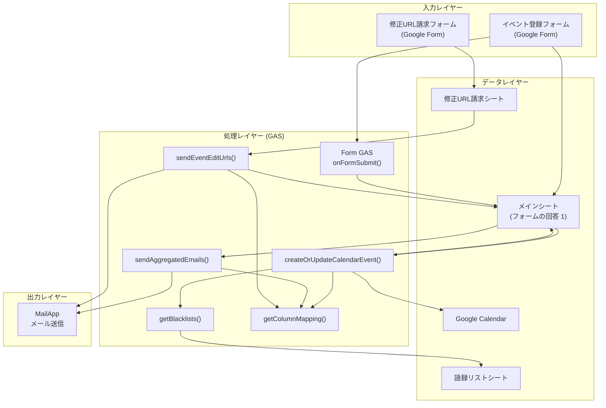
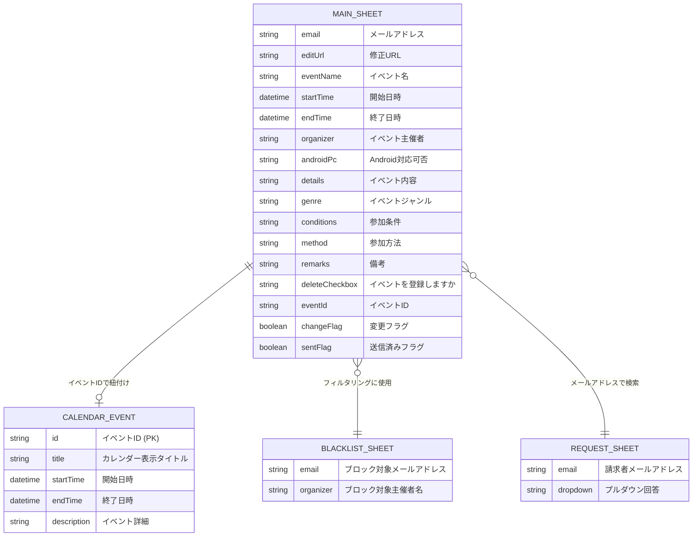
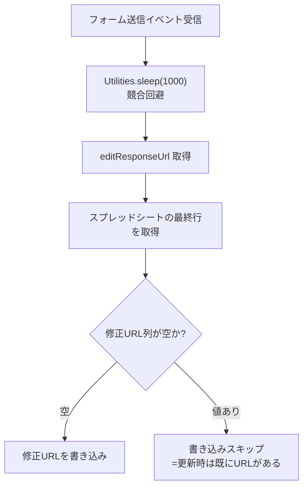
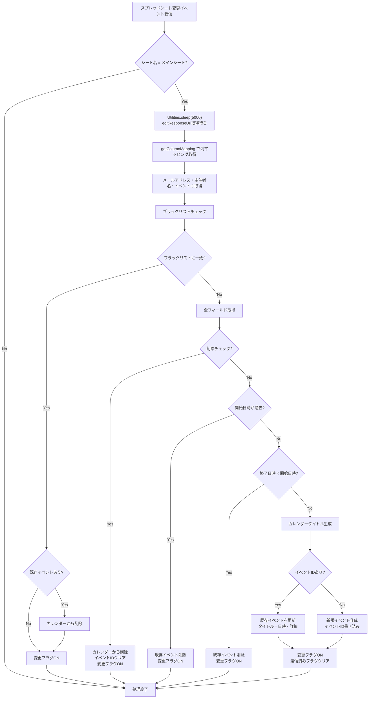
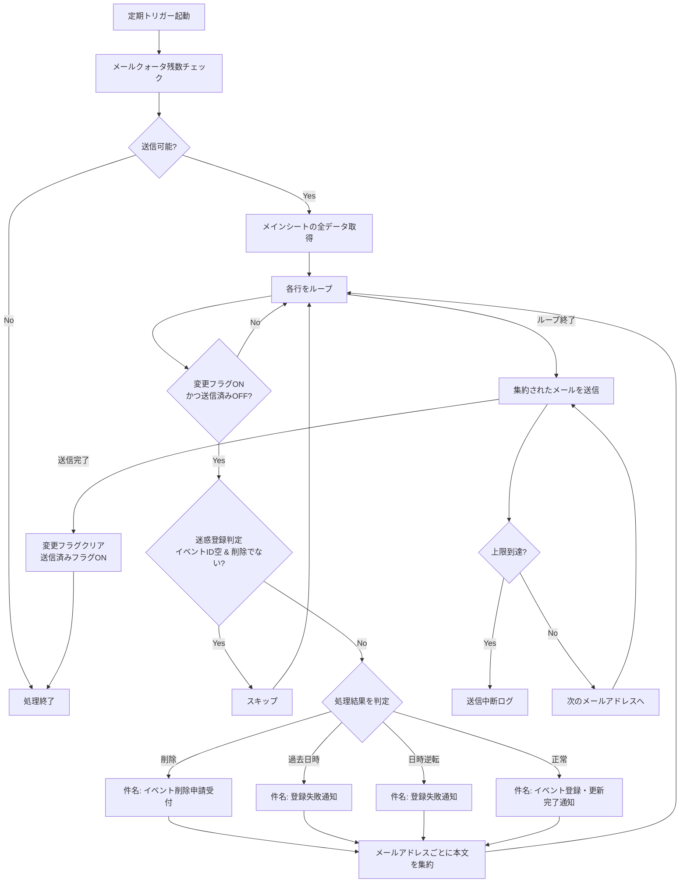
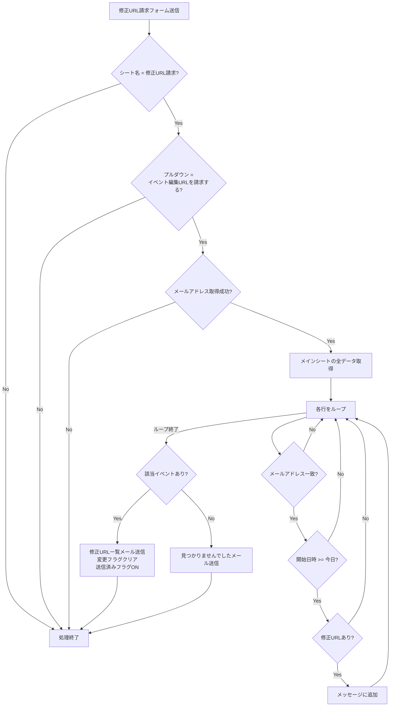
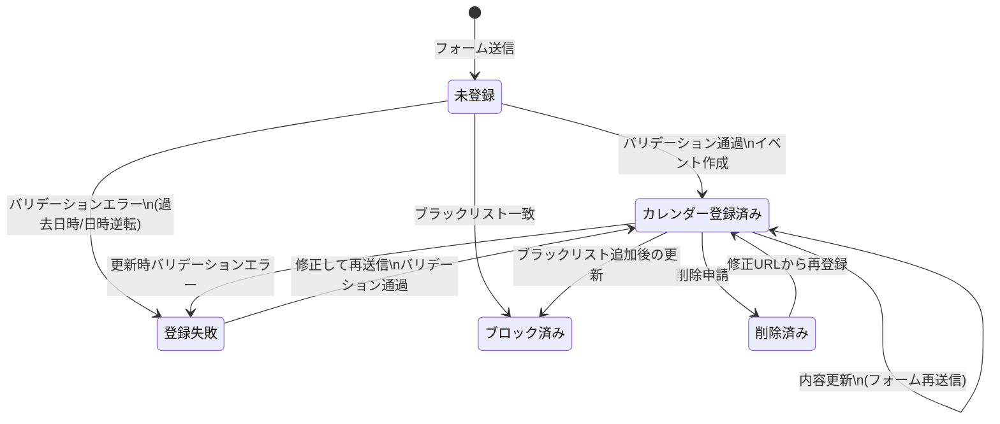

# 機能設計書 (Functional Design Document)

## 1. システム構成図



---

## 2. データモデル定義

### 2.1 メインシート（フォームの回答 1）

スプレッドシートのヘッダー行をキーとして列番号を動的にマッピングする。以下が定義済みの列名定数：

```javascript
// 列名定数（グローバル設定）
const COL_EMAIL = 'メールアドレス';
const COL_EVENT_NAME = 'イベント名';
const COL_EDIT_URL = '修正URL';
const COL_DELETE_CHECKBOX = 'イベントを登録しますか';
const COL_EVENT_ID = 'イベントID';
const COL_START_TIME = '開始日時';
const COL_END_TIME = '終了日時';
const COL_EVENT_ORGANIZER = 'イベント主催者';
const COL_ANDROID_PC = 'Android対応可否';
const COL_EVENT_DETAILS = 'イベント内容';
const COL_EVENT_GENRE = 'イベントジャンル';
const COL_CONDITIONS = '参加条件（モデル、人数制限など）';
const COL_METHOD = '参加方法';
const COL_REMARKS = '備考';
const CHANGE_FLAG_COLUMN_NAME = '変更フラグ';
const SENT_FLAG_COLUMN_NAME = '送信済みフラグ';
```

**制約**:
- ヘッダー行（1行目）は列名定数と一致していなければならない
- 列順は任意（`getColumnMapping()` で動的に解決される）
- `イベントID` はシステムが自動生成（Google Calendar のイベントID）

### 2.2 語録リストシート（ブラックリスト）

| 列 | 内容 | 型 |
|----|------|-----|
| A列 | ブラックリスト対象メールアドレス | String（小文字で比較） |
| B列 | ブラックリスト対象イベント主催者名 | String（小文字で比較） |

**制約**:
- 1行目はヘッダー（データは2行目以降）
- 空行は無視
- 比較時に `trim()` + `toLowerCase()` で正規化

### 2.3 修正URL請求シート

| 列インデックス | 内容 |
|--------------|------|
| `e.values[1]` | 請求者のメールアドレス |
| `e.values[2]` | プルダウン回答（「イベント編集URLを請求する」） |

### 2.4 データ関連図



---

## 3. コンポーネント設計

### 3.1 onFormSubmit(e) — Form GAS

**責務**: フォーム送信時に修正URLをスプレッドシートに記録する

**入力**:
| パラメータ | 型 | 説明 |
|-----------|-----|------|
| `e` | FormEvent | Google Forms のイベントオブジェクト |
| `e.response` | FormResponse | フォーム回答オブジェクト |

**処理フロー**:



**環境差異**:

| 環境 | 書き込み先列 | スプレッドシートID |
|------|------------|-----------------|
| dev | 2列目 | `1rHTVTMSDbWq9XDY1dkAY7Sr99TNvlz35DuupZsgaRoE` |
| prod | 16列目 | `1khYEj0t3eI2LnYxgnN3uJUKHHQg8CJTk3JD3vITQlQc` |
| dev_multi | 22列目 | `1rPnRV15D_m69ai8bHZOVAFIu8W0kuSwoE-1saJEIfgM` |

> **注意**: prod と dev_multi はハードコードされた列番号を使用。dev は修正URL列が空かどうかを制御に使用。

---

### 3.2 createOrUpdateCalendarEvent(e) — Spreadsheet GAS

**責務**: スプレッドシートの変更をトリガーに、カレンダーイベントの登録・更新・削除を行う

**入力**:
| パラメータ | 型 | 説明 |
|-----------|-----|------|
| `e` | SpreadsheetEvent | スプレッドシート変更イベント |
| `e.range` | Range | 編集されたセル範囲 |
| `e.values` | Array | 編集された行の値 |

**処理フロー**:



**カレンダータイトル生成ロジック**:

```javascript
// Android対応可否によるタイトル加工
var VRCTitle = eventName;
if (android_pc === "PC/android") {
    VRCTitle = '【Android 対応】' + VRCTitle;
} else if (android_pc === "android only") {
    VRCTitle = '【Android オンリー】' + VRCTitle;
}
```

**カレンダー詳細（description）の構成**:

```
【イベント主催者】
　{主催者名}
【イベント内容】
　{内容}
【イベントジャンル】
　{ジャンル}
【参加条件（モデル、人数制限など）】
　{条件}
【参加方法】
　{方法}
【備考】
　{備考}
```

---

### 3.3 sendAggregatedEmails() — Spreadsheet GAS

**責務**: 変更フラグが立った行を集約し、メールアドレスごとに1通のメールで通知する

**入力**: なし（定期トリガーで呼び出し）

**処理フロー**:



**メール本文の構成**:

```
いつもご利用ありがとうございます。

VRChatイベントカレンダーへの登録結果をお知らせします。内容をご確認ください。
----------------------------------------
【{イベント名} ({日時}～)】
{処理結果メッセージ}
{修正URL}

----------------------------------------
（複数イベントがある場合、上記ブロックが繰り返される）

----------------------------------------
■ VRChatイベントカレンダーで確認する
【カレンダーURL】 https://vrceve.com/

ご不明な点がありましたら、管理者までお問い合わせください。
引き続き、ご利用をお待ちしております。
```

**処理結果メッセージのパターン**:

| 条件 | 件名 | 本文 |
|------|------|------|
| 「イベントを削除する」選択 | イベント削除申請受付 | 削除申請を受け付けました。再度、登録する場合は下記のURLから登録できます。 |
| 開始日時が過去 | 登録失敗通知 | イベントの開始日時が過去のため、登録できませんでした。 |
| 終了日時 < 開始日時 | 登録失敗通知 | イベントの終了日時が開始日時より前のため、登録できませんでした。 |
| 正常登録/更新 | イベント登録・更新完了通知 | 新しいイベントが登録されました、または内容が更新されました。 |

---

### 3.4 sendEventEditUrls(e) — Spreadsheet GAS

**責務**: 修正URL請求フォームの送信をトリガーに、請求者のメールアドレスに紐づく未来のイベントの修正URLを一括送信する

**入力**:
| パラメータ | 型 | 説明 |
|-----------|-----|------|
| `e` | SpreadsheetEvent | スプレッドシート変更イベント |
| `e.values[1]` | String | 請求者のメールアドレス |
| `e.values[2]` | String | プルダウンの回答 |

**処理フロー**:



**送信メールの構成（該当あり）**:

```
以下のイベントの修正URLをまとめました。

--------------------------------------
イベント名: {イベント名}
開始日時: {yyyy/MM/dd HH:mm}
修正URL: {URL}
--------------------------------------
（複数イベントがある場合繰り返し）

--------------------------------------
上記以外の過去のイベントは自動で除外されています。
```

---

### 3.5 getColumnMapping(sheet) — ユーティリティ

**責務**: スプレッドシートのヘッダー行を解析し、列名から列番号へのマッピングを返す

**入力**:
| パラメータ | 型 | 説明 |
|-----------|-----|------|
| `sheet` | Sheet | 対象のスプレッドシートオブジェクト |

**出力**:
| 戻り値 | 型 | 説明 |
|--------|-----|------|
| `columns` | Object | `{ "列名": 列番号(1始まり), ... }` |

**処理**:
1. 1行目の全列の値を取得
2. 列名（空でない値）をキー、列番号（1始まり）を値とするオブジェクトを作成
3. `sheet` が null/undefined の場合は空オブジェクトを返す

---

### 3.6 getBlacklists() — ユーティリティ

**責務**: 語録リストシートからブラックリスト情報を読み込む

**入力**: なし

**出力**:
| 戻り値 | 型 | 説明 |
|--------|-----|------|
| `result.keywords` | Array | 空配列（未使用） |
| `result.emails` | Array | ブロック対象メールアドレスの配列（小文字・トリム済み） |
| `result.organizers` | Array | ブロック対象主催者名の配列（小文字・トリム済み） |

**処理**:
1. 「語録リスト」シートを取得（なければ空結果を返す）
2. A2:B{最終行} の範囲からデータを取得
3. A列をメールアドレス、B列を主催者名として配列に格納
4. すべて `trim().toLowerCase()` で正規化

---

## 4. 状態遷移

### イベントの状態遷移



### フラグの状態遷移

| 操作 | 変更フラグ | 送信済みフラグ |
|------|----------|--------------|
| カレンダー登録/更新成功 | ON | クリア |
| カレンダー削除 | ON | クリア |
| バリデーションエラー | ON | クリア |
| ブラックリスト一致 | ON | 変更なし |
| メール送信完了 | クリア | ON |
| 修正URL請求で処理 | クリア | ON |

---

## 5. エラーハンドリング

### エラー分類と対応

| エラー種別 | 発生条件 | システムの動作 | ユーザーへの通知 |
|-----------|---------|--------------|----------------|
| 過去日時エラー | 開始日時が今日より前 | 既存イベント削除、変更フラグON | 「登録失敗通知」メール（修正URLを含む） |
| 日時逆転エラー | 終了日時 < 開始日時 | 既存イベント削除、変更フラグON | 「登録失敗通知」メール（修正URLを含む） |
| ブラックリスト | メールまたは主催者名が一致 | 既存イベント削除、変更フラグON | 通知なし（サイレントブロック） |
| メール送信エラー | MailApp.sendEmail() 失敗 | try-catch でログ出力、他メールの送信は継続 | 該当メールのみ未送信 |
| クォータ超過 | メール送信上限到達 | 送信中断、残りは次回実行で処理 | 遅延あり（次回定期実行まで） |
| シート未検出 | 対象シートが存在しない | 処理を中断（return） | 通知なし |
| イベント未検出 | イベントIDに対応するカレンダーイベントがない | 新規イベントとして作成 | 正常として通知 |

---

## 6. グローバル設定パラメータ

```javascript
// シート名
const MAIN_EVENT_SHEET_NAME = 'フォームの回答 1';
const REQUEST_URL_SHEET_NAME = '修正URL請求';
const BLACKLIST_SHEET_NAME = '語録リスト';

// Google Calendar ID（環境ごとに異なる）
const CALENDAR_ID = '{環境固有のカレンダーID}';

// カレンダーURL（通知メールに記載）
const NOTIFICATION_CALENDAR_URL = 'https://vrceve.com/';

// メール送信制限
const MAX_EMAILS_PER_RUN = 20;
```

**環境移行チェックリスト**:
- [ ] `CALENDAR_ID` を対象環境のものに変更
- [ ] `onFormSubmit()` 内のスプレッドシートID・列番号を確認
- [ ] シート名が定数と一致していることを確認
