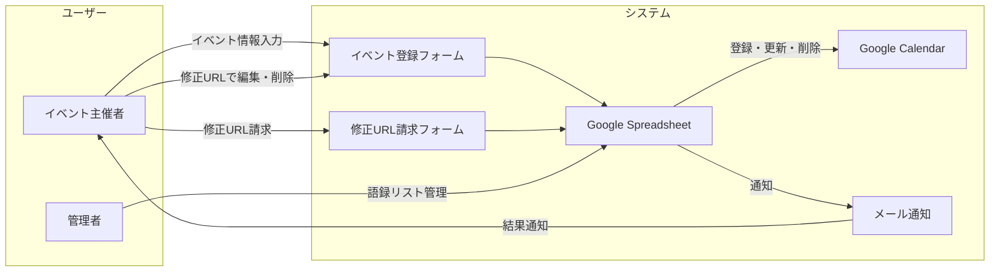

# プロダクト要件定義書（PRD）

## 1. プロダクト概要

### 1.1 プロダクト名
VRChatイベントカレンダー 自動化システム

### 1.2 目的
VRChat コミュニティのイベント主催者が Google Forms からイベント情報を登録・編集・削除でき、その内容が自動的に Google Calendar に反映される仕組みを提供する。

### 1.3 解決する課題
- イベント主催者が手動でカレンダーに登録する手間を排除
- イベント情報の一元管理（スプレッドシート + カレンダー）
- 登録・更新・削除の結果を主催者にメールで自動通知

### 1.4 対象ユーザー
- **イベント主催者**: VRChat でイベントを開催し、カレンダーに掲載したい人
- **カレンダー閲覧者**: VRChat イベントカレンダー（vrceve.com）を通じてイベントを探す人
- **管理者**: システムの運用・迷惑登録対策を行う人

---

## 2. 機能要件

### 2.1 イベント登録（新規）
- **トリガー**: Google Forms からイベント情報を送信
- **処理内容**:
  - フォーム送信時に修正URL（editResponseUrl）をスプレッドシートに自動記録
  - スプレッドシートへの書き込みをトリガーに Google Calendar にイベントを作成
  - 作成されたイベントID をスプレッドシートに記録
- **登録される情報**:
  - イベント名
  - 開始日時・終了日時
  - イベント主催者
  - イベント内容
  - イベントジャンル
  - 参加条件（モデル、人数制限など）
  - 参加方法
  - 備考
  - Android 対応可否（PC/android, android only）
- **カレンダータイトルの自動整形**:
  - Android 対応の場合: `【Android 対応】イベント名`
  - Android オンリーの場合: `【Android オンリー】イベント名`

### 2.2 イベント更新
- **トリガー**: 主催者がフォームの修正URLから内容を編集し再送信
- **処理内容**:
  - 既存のイベントID に紐づくカレンダーイベントのタイトル・日時・詳細を更新
  - 変更フラグを立て、後続のメール通知処理に引き継ぐ

### 2.3 イベント削除
- **トリガー**: フォームで「イベントを削除する」を選択して送信
- **処理内容**:
  - カレンダーからイベントを削除
  - スプレッドシートのイベントID をクリア
  - 変更フラグを立て、削除通知メールの送信準備

### 2.4 バリデーション
以下の条件に該当する場合、カレンダーへの登録を行わず、エラー通知メールを送信する。

| バリデーション | 条件 | 動作 |
|---|---|---|
| 過去日時チェック | 開始日時が今日より過去 | 既存イベントがあれば削除、エラー通知 |
| 日時逆転チェック | 終了日時が開始日時より前 | 既存イベントがあれば削除、エラー通知 |

### 2.5 メール通知（集約送信）
- **トリガー**: 時間ベースのトリガー（定期実行）
- **処理内容**:
  - 変更フラグが ON かつ送信済みフラグが OFF の行を検索
  - 同一メールアドレスの複数イベントを1通にまとめて通知
  - 通知内容に応じた件名・本文を生成（登録完了、削除受付、登録失敗）
  - 送信後、送信済みフラグを ON に更新
- **レート制限**:
  - 1回の実行あたり `MAX_EMAILS_PER_RUN`（デフォルト20件）まで送信
  - GAS のメール送信クォータ残数と比較し、低い方を採用
- **迷惑登録のスキップ**:
  - イベントID が空 かつ 変更フラグ ON かつ 削除でない → メール送信をスキップ

### 2.6 修正URL請求
- **トリガー**: 修正URL請求フォーム（別フォーム）の送信
- **処理内容**:
  - 請求者のメールアドレスに紐づく未来のイベントを検索
  - 該当イベントの修正URLを一覧にまとめてメール送信
  - 該当なしの場合は「見つかりませんでした」メールを送信
- **請求条件**: プルダウンで「イベント編集URLを請求する」を選択していること

### 2.7 迷惑登録フィルタリング（ブラックリスト）
- **データソース**: 「語録リスト」シート
  - A列: ブラックリスト対象メールアドレス
  - B列: ブラックリスト対象イベント主催者名
- **処理内容**:
  - メールアドレスまたは主催者名がブラックリストに一致 → カレンダー登録をブロック
  - 既存イベントがある場合は削除
  - 変更フラグを立てるが、メール通知はスキップされる（2.5 の迷惑登録スキップ）

---

## 3. 非機能要件

### 3.1 実行環境
- Google Apps Script（サーバーレス）
- Google Workspace のクォータ制限に準拠

### 3.2 トリガー構成
| トリガー種別 | 対象 | 関数 |
|---|---|---|
| フォーム送信時 | Google Form | `onFormSubmit()` |
| スプレッドシート編集時 | Spreadsheet | `createOrUpdateCalendarEvent()` |
| 時間ベース（定期） | Spreadsheet | `sendAggregatedEmails()` |
| フォーム送信時（請求フォーム） | Spreadsheet | `sendEventEditUrls()` |

### 3.3 データ管理
- **マスターデータ**: Google Spreadsheet（フォームの回答シート）
- **カレンダーとの同期**: イベントID による紐付け
- **フラグ管理**: 変更フラグ・送信済みフラグによる処理状態の追跡

### 3.4 セキュリティ
- ブラックリストによる迷惑登録防止
- 修正URLは登録者のメールアドレスにのみ送信

---

## 4. ユースケース図

---

## 5. 用語定義

| 用語 | 定義 |
|---|---|
| 修正URL | フォーム回答の編集リンク（editResponseUrl）。登録者が自分のイベント情報を後から変更するために使用 |
| 変更フラグ | カレンダー処理が完了した行に立てるフラグ。メール通知の対象判定に使用 |
| 送信済みフラグ | メール送信が完了した行に立てるフラグ。二重送信を防止 |
| 語録リスト | ブラックリスト情報を管理するシート |
| イベントID | Google Calendar が発行するイベントの一意識別子。スプレッドシートに記録して更新・削除に使用 |
